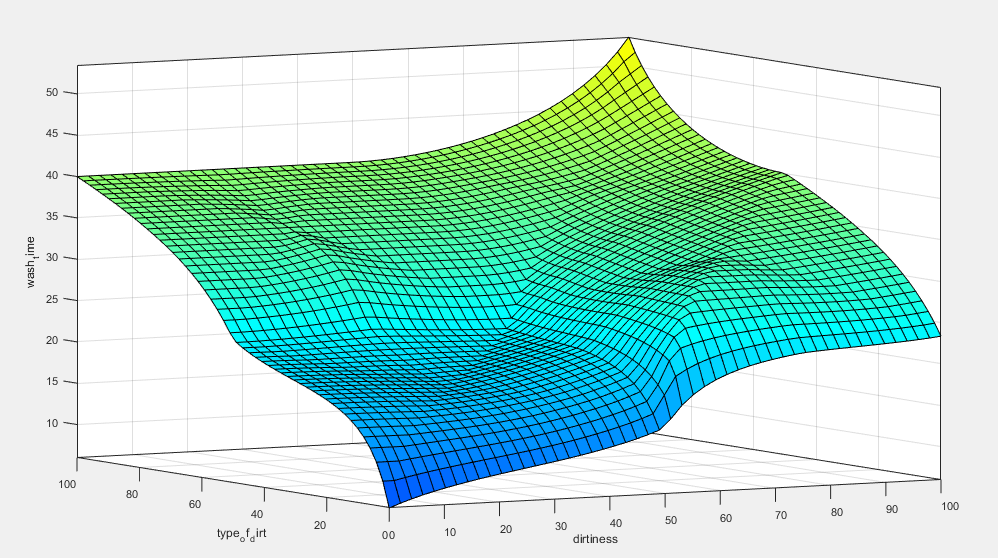
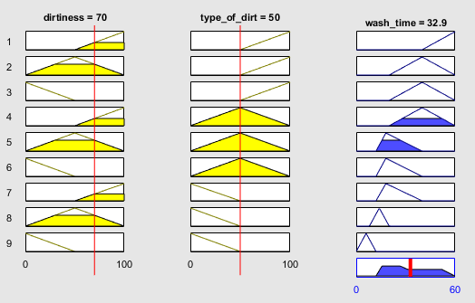
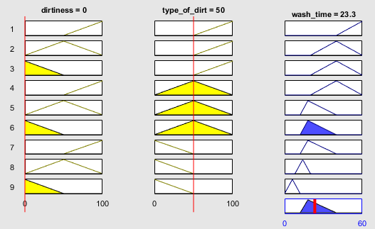
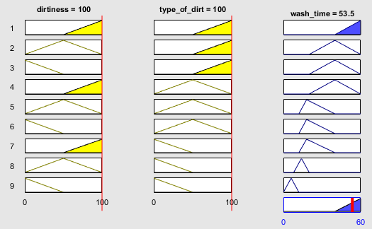
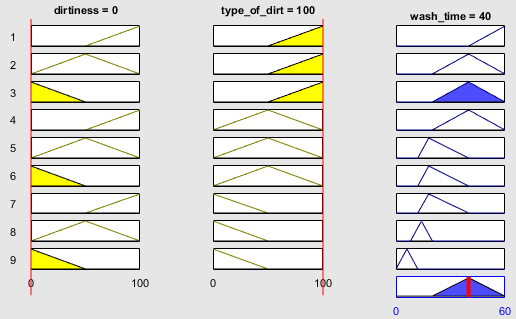
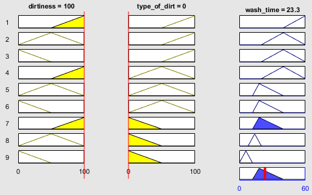

# Assignment 1
### Washing Machine Fuzzy Logic Controller

##### Question 1
---
a)

	This is the surface for the base fuzzy logic system.
	I think that for its simplicity in the number of variables, it does a good job in deciding on a logical wash time length.
	I find it interesting how this rule base finds that when the type of dirt is more greasy it outputs a longer wash time, than when the level of dirt is higher.
	What I find interesting about this is that if there is zero dirtiness on the clothes but somehow the type of dirt is very greasy then the wash time will be long.
	However, when the clothes are very dirty (10) but the type of dirt is not greasy then the wash time will be shorter than if the clothes have almost no dirt but the dirt is greasy.
	I feel that this is intrinsically wrong given my knowledge of washing clothes.
b)

	Wash time for different loads based on this fuzzy system
i)

	Dirtiness = 70; Type = 50;
	Wash Time = 32.9 minutes

ii)

	Dirtiness = 0; Type = 50;
	Wash Time = 23.3 minutes

iii)

	Dirtiness = 100; Type = 100;
	Wash Time = 53.5 minutes

iv)

		Dirtiness = ?;
		Type = 100 and Wash time is smallest.

		40 minutes is the minimum wash time for when the type of dirt is 100 greasy.

v)

	Dirtiness = 100;
	Type = ? and Wash time is smallest.

	23.3 is the minimum wash time for when the dirtiness is 100 large.
